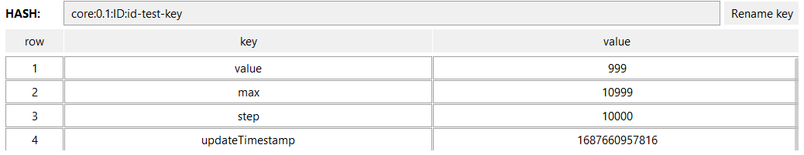
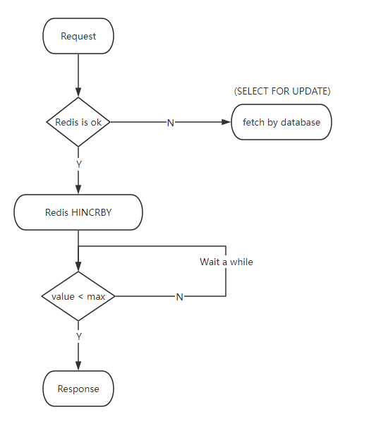
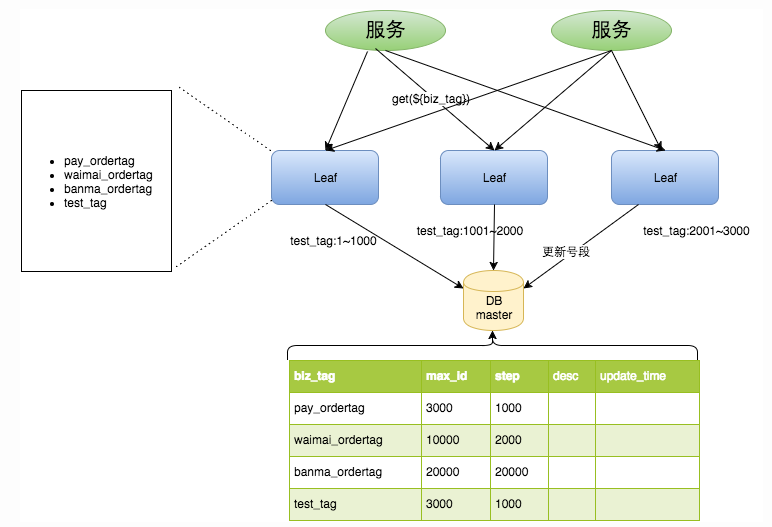

# Implementation Principle

### Redis
**Summary**: In the initialization phase, a segment of data is requested from the database using Redis, with the maximum value identified as "max" and the current value identified as "value". Subsequently, when retrieving values from Redis, a Lua script is employed to determine if the current segment of IDs has been exhausted. Since Redis operates in a single-threaded read-write manner, we have scheduled tasks to periodically check if the ID segment has reached a threshold, and if so, replenish it accordingly.

**Process Description:**

### Segment
**Summary**: Reference Meituan Leaf implementation solution.

### Snowflake
**Summary**: Referencing the improved approach based on Meituan Snowflake.
