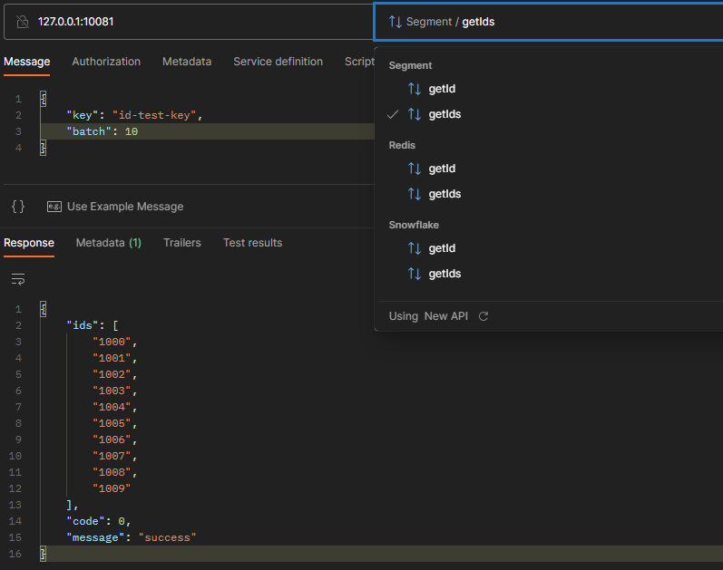

# Configuration Reference

1. `distributed-id.yaml`

   Purpose: Used for basic project configuration.

```yaml
distributed:
   # Database related configuration, if only Snowflake is enabled, this can be left unconfigured.
   datasource:
      url: jdbc:mysql://127.0.0.1:3306/distributed_id?useUnicode=true&characterEncoding=UTF-8&useSSL=false&allowPublicKeyRetrieval=true&zeroDateTimeBehavior=convertToNull&serverTimezone=GMT%2B0
      password: username
      username: password
   redis:
      # Control whether Redis mode is enabled. If enabled, framework-core-redis configuration is required.
      enable: true
   segment:
      # Control whether segment mode is enabled.
      enable: true
   snowflake:
      # Control whether Snowflake mode is enabled.
      enable: true
      zookeeper:
         # This configuration is mandatory when enabled (cluster mode, use commas to separate IP addresses).
         address: 127.0.0.1:2181
```
#### How to Integrate the Client

##### Using HTTP:

**Endpoint Description**: Get Distributed ID

**Request Method**: GET

**Request Paths**:

- /distributed/{type}/{key}  (Get single ID without concatenation)
- /distributed/{type}/{key}/{batch} (Get multiple IDs without concatenation)
- /distributed/{type}/{key}/{prefix}/{length} (Get single ID with prefix concatenation and length padding)
- /distributed/{type}/{key}/{batch}/{prefix}/{length}  (Get multiple IDs with prefix concatenation and length padding)

**Test Endpoint**: NONE

**Parameters**:

| Parameter Name | Type   | Required | Location | Description                                  |
| -------------- | ------ | -------- | -------- | -------------------------------------------- |
| type           | string | yes      | path     | Represents the type of distributed ID implementation. Options: redis, snowflake, segment |
| key            | string | yes      | path     | Unique business identifier                    |
| batch          | int    | no       | path     | Represents the quantity. If not passed, it defaults to a single distributed ID; if passed, it retrieves a batch of IDs. |
| prefix         | string | no       | path     | Concatenated prefix, e.g., SN                 |
| length         | int    | no       | path     | Limits the entire distributed ID length. Must be > 0, and greater than prefix (length) + id (original length). If so, add leading zeros to the id. Example: SN0001. If <= 0, concatenate and return directly without adding zeros. Example: SN123456 (It is recommended to directly pass -1) |

**Response Type**: application/json

**Response Parameters**:

| Parameter Name | Type   | Description                            |
| -------------- | ------ | -------------------------------------- |
| code           | int    | 0 indicates success, others indicate failure |
| success        | boolean| true if code is 0, false otherwise     |
| data           | long   | Responds with a single ID if requested individually, or a list if requested in batch |
| msg            | string | Detailed description of the response code |

**Example for Success Response:**

```JSON
Single:
{
    "code": 0,
    "success": true,
    "data": 406,
    "msg": "success"
}

{
    "code": 0,
    "success": true,
    "data": "SN5102",
    "msg": "success"
}
Batch:
{
    "code": 0,
    "success": true,
    "data": [
        400,
        401
    ],
    "msg": "success"
}

{
    "code": 0,
    "success": true,
    "data": [
        "SN5092",
        "SN5093",
        "SN5094",
        "SN5095",
        "SN5096",
        "SN5097",
        "SN5098",
        "SN5099",
        "SN5100",
        "SN5101"
    ],
    "msg": "success"
}
```

**Error Examples**:

```JSON
{
    "code": 500,
    "success": false,
    "data": null,
    "msg": "distributed-id server error"
}
```

##### Using gRPC:

proto File:

```ProtoBuf
syntax = "proto3";

option java_multiple_files = false;
option java_package = "tech.finovy.distributed.id.grpc";
option java_outer_classname = "DistributedIdProto";

service Segment {
  rpc getId(IdRequest) returns (IdResponse) {}
  rpc getIds(IdListRequest) returns (IdListResponse) {}
}

service Redis {
  rpc getId(IdRequest) returns (IdResponse) {}
  rpc getIds(IdListRequest) returns (IdListResponse) {}
}

service Snowflake {
  rpc getId(IdRequest) returns (IdResponse) {}
  rpc getIds(IdListRequest) returns (IdListResponse) {}
}

message IdRequest {
  string key = 1;
}

message IdResponse {
  int32  code = 1;
  int64 data = 2;
  string message = 3;
}

message IdListRequest {
  string key = 1;
  int32 batch = 2;
}

message IdListResponse {
  int32 code = 1;
  repeated int64 data = 2;
  string message = 3;
}
```


Example for Success Response:

```JSON
Single
{
    "ids": [
        "119041"
    ],
    "code": 0,
    "message": "success"
}
Batch
{
    "code": 0,
    "id": "407",
    "message": "success"
}
```

##### Using Rpc(Dubbo):

**Dependency Introduction::**
```XML
<dependency>
   <groupId>tech.finovy</groupId>
   <artifactId>distributed-id-api</artifactId>
</dependency>
```

**Usage Example:**

```Java
@DubboReference(group = "redis")
DistributedIdService idService;
//
Long id = idService.getId("distributed-id-key");
List<Long> ids = idService.getIds("distributed-id-key",100);

String id = idService.getId("distributed-id-key", "SN", 99);
List<String> ids = idService.getIds("distributed-id-key", 100, "SN", 99);
```

Note: The 'group' parameter is mandatory but optional values are: redis, snowflake, segment. These represent different implementation methods, each suitable for different use cases.
